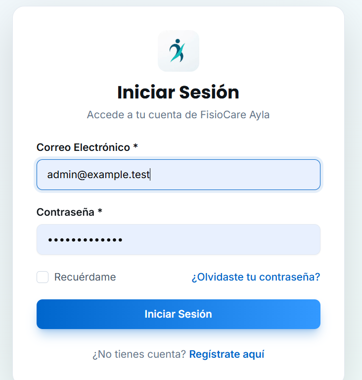
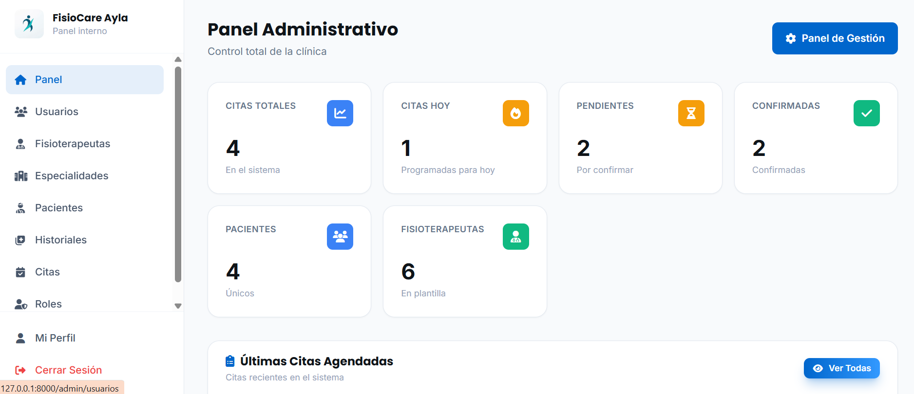
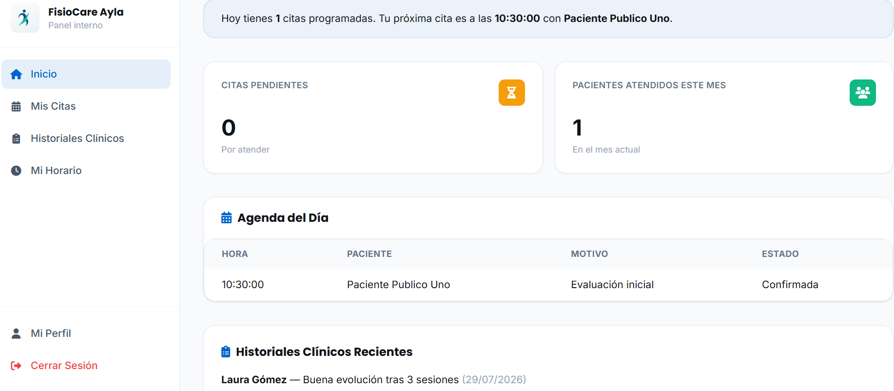
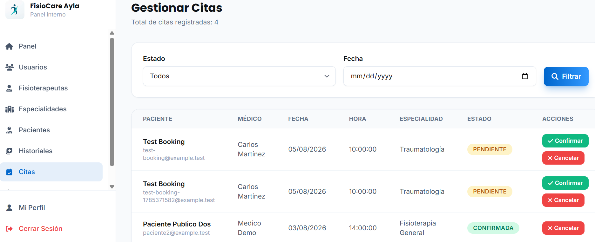

<div align="center">
  

  # FisioCare Ayla

  **Plataforma de gestión para clínicas de fisioterapia** — agendamiento público de citas, paneles según el rol, historiales clínicos y horarios del personal, construida con Laravel.

  [](https://www.php.net/)
  [](https://laravel.com/)
  [](https://www.mysql.com/)
  [](https://tailwindcss.com/)
  [](https://alpinejs.dev/)
  [](https://vitejs.dev/)

  [English](README.md) · **Español**
</div>

---

## Descripción general

FisioCare Ayla es una aplicación web pensada para una clínica de fisioterapia real: un sitio público donde los pacientes potenciales conocen las especialidades de la clínica y agendan una cita en línea, y un sistema interno donde **Administradores**, **Fisioterapeutas** y **Pacientes** tienen cada uno un panel adaptado a su rol — citas, historiales clínicos, horarios de los terapeutas y estadísticas generales de la clínica.

Es una aplicación Laravel renderizada del lado del servidor, a propósito: vistas Blade, Tailwind CSS para los estilos, y Alpine.js para los pequeños detalles de interactividad (consulta de disponibilidad en vivo, acordeones de preguntas frecuentes, carruseles de imágenes) — sin framework de SPA ni un pipeline de build de frontend independiente que mantener.

## Capturas de pantalla

<table>
  <tr>
    <td width="100%" colspan="2" align="center">
      <br/>
      <sub align="center">Sitio público — hero, especialidades, testimonios y preguntas frecuentes</sub>
    </td>
  </tr>
  <tr>
    <td width="50%"><br/><sub align="center">Inicio de sesión</sub></td>
    <td width="50%"><br/><sub align="center">Panel de administrador</sub></td>
  </tr>
  <tr>
    <td width="50%"><br/><sub align="center">Panel del fisioterapeuta — agenda del día y notas clínicas recientes</sub></td>
    <td width="50%"><br/><sub align="center">Admin — gestión de citas</sub></td>
  </tr>
</table>

## Funcionalidades

**Sitio público**
- Página de inicio con sección hero, presentación de la clínica, nueve tarjetas de especialidad (traumatológica, deportiva, pediátrica, geriátrica, cardiovascular, respiratoria, ocupacional, cuidados paliativos y comunitaria), testimonios de pacientes y una sección de preguntas frecuentes.
- Agendamiento público de citas (sin necesidad de cuenta): se elige una especialidad, luego solo los fisioterapeutas que la cubren, luego una fecha, y luego solo los horarios que ese fisioterapeuta realmente tiene libres — resuelto en tiempo real mediante un endpoint AJAX filtrado por especialidad y horario laboral.
- Correo de confirmación automático al paciente al enviar el formulario de la cita.

**Citas**
- Dos flujos de citas en paralelo: `citas` (interno, creado por el personal para pacientes registrados) y `citas_publicas` (agendamiento público, tipo "sin cita previa", identificado por correo/cédula hasta que el paciente tiene una cuenta).
- Flujo de estados (`pendiente → confirmada`, además de `cancelada`) con acciones del administrador para confirmar o cancelar cualquier cita.
- Los fisioterapeutas tienen una agenda del día, su listado completo de citas, y pueden confirmar citas o agregar una nota clínica directamente desde su vista.

**Historiales clínicos**
- `historiales_clinicos` vincula a un paciente y un fisioterapeuta con observaciones, diagnóstico y tratamiento por cada consulta.
- Archivos adjuntos por historial (PDF, imágenes, Word, hasta 10MB) — resultados de laboratorio, notas, referencias — guardados de forma privada y descargables solo por el fisioterapeuta tratante o un admin.
- Recetas de texto libre (`recetas`) por cita: el fisioterapeuta escribe medicamentos e indicaciones, y desde ahí se abre una vista imprimible con el membrete de la clínica.
- El acceso está acotado por rol a nivel de controlador, no solo oculto en la interfaz: el listado, la vista, la edición y los adjuntos de historiales de un fisioterapeuta quedan filtrados a sus propios pacientes — intentar abrir el historial de otro devuelve un 403, incluso adivinando la URL.

**Personal y horarios**
- Perfiles de fisioterapeutas (datos de contacto, número de colegiado, especialidad, horario laboral) administrables desde el panel de administrador.
- Horario semanal por fisioterapeuta (`horarios`: día, disponibilidad, hora de inicio/fin) — cada terapeuta puede editar el suyo desde "Mi horario"; la disponibilidad que ve el público se calcula a partir de esto.

**Plataforma**
- Control de acceso por rol propio (middleware `CheckRole`) para tres roles — `paciente`, `medico` (fisioterapeuta) y `admin` — almacenados en una tabla `roles` dedicada en lugar de un paquete externo, con rutas, menús y el dashboard adaptándose todos al rol de quien inició sesión.
- Autorización también a nivel de ruta: el catálogo completo de pacientes/especialidades/citas/roles es exclusivo de admin; los fisioterapeutas tienen sus propias vistas ya acotadas (`/medico/*`) en vez del CRUD general de administración.
- Autenticación basada en Laravel Breeze (registro, inicio de sesión, recuperación de contraseña, verificación de correo).
- CRUD completo de administrador para pacientes, fisioterapeutas, especialidades, citas, usuarios y roles.
- Una pequeña librería de componentes Blade compartidos (`components/ui/*`: inputs, botones, tarjetas, tablas, badges) y dos layouts base (`components/layouts/internal.blade.php` para la app autenticada, `components/layouts/auth.blade.php` para login/registro) para que cada pantalla interna comparta un mismo sistema de diseño basado en Tailwind, en vez de estilos sueltos por página.

## Stack tecnológico

| Capa | Elección |
|---|---|
| Framework | Laravel 12 (PHP 8.2) |
| Base de datos | MySQL, vía Eloquent ORM (SQLite soportado para desarrollo local) |
| Autenticación | Laravel Breeze, middleware propio `CheckRole` para autorización basada en roles |
| Frontend | Vistas Blade, Tailwind CSS 3, Alpine.js, Vite |
| Pruebas | Pest (pruebas unitarias y de feature) |
| Herramientas | Laravel Pint (estilo de código), Laravel Pail (visor de logs), Laravel Tinker |

### Un par de decisiones técnicas que vale la pena mencionar

- **Roles como datos, no como paquete**: en vez de incorporar un paquete completo de permisos, los roles viven en una tabla simple `roles` (`paciente` / `medico` / `admin`) referenciada por `rol_id` en el usuario, verificada por un pequeño middleware propio `CheckRole` (`->middleware('role:admin')`). Suficiente para tres roles fijos, sin la sobrecarga de un sistema de ACL de propósito general.
- **Dos tablas de citas, a propósito**: `citas` sirve al flujo interno original vinculado a un `Paciente` registrado, mientras que `citas_publicas` recoge el flujo de agendamiento público sin cuenta (identificado por cédula/correo) que terminó siendo el principal — se mantuvieron separadas en lugar de forzar ambas formas dentro de un mismo esquema.
- **Disponibilidad en vivo sin librería de calendario**: el formulario público de agendamiento llama a `/api/fisioterapeutas/{especialidad}` para filtrar fisioterapeutas por especialidad y horario laboral mientras el visitante completa el formulario, en lugar de cargar todos los fisioterapeutas de antemano o incrustar un widget de calendario completo.

## Roles y permisos

| | Administrador | Fisioterapeuta | Paciente |
|---|:---:|:---:|:---:|
| Dashboard (estadísticas según el rol) | ✅ | ✅ | ✅ |
| Gestionar citas (confirmar/cancelar, todas) | ✅ | solo las propias | solo agendar |
| Agenda del día / mis citas | – | ✅ | ✅ (propias) |
| Historiales clínicos (listar/ver/editar/adjuntos) | ✅ (todos) | ✅ (solo sus pacientes — forzado en el servidor, 403 si no) | – |
| Recetas | – | ✅ (sus propias citas) | – |
| Pacientes, especialidades, citas internas, roles (CRUD) | ✅ | – | – |
| Usuarios y roles | ✅ | – | – |
| Mi horario (jornada laboral semanal) | – | ✅ | – |

## Cómo ejecutarlo

### Requisitos

- PHP 8.2+ y Composer
- Node.js + npm
- MySQL/MariaDB (o SQLite para una prueba local rápida)

### Configuración

```bash
git clone https://github.com/Luzmy555/physiocare-laravel.git
cd physiocare-laravel

composer install
npm install

cp .env.example .env
php artisan key:generate
# Configura DB_* en .env con tus credenciales de MySQL, o cambia a DB_CONNECTION=sqlite
# y crea database/database.sqlite para correrlo localmente sin configuración adicional.

php artisan migrate --seed
npm run build

php artisan serve
```

La app queda disponible en `http://localhost:8000`. El seeding crea los tres roles, un conjunto de especialidades, y fisioterapeutas de ejemplo — revisa `database/seeders/` para más detalle.

Para desarrollo activo, `composer run dev` levanta el servidor de PHP, el listener de colas, el visor de logs y el servidor de desarrollo de Vite juntos.

## Estructura del proyecto

```
app/
├── Http/Controllers/    # Citas, Pacientes, Fisioterapeutas, Especialidades, Historiales, Usuarios, Roles, Horarios, Dashboard...
├── Http/Middleware/     # CheckRole — acceso a rutas basado en rol
└── Models/              # Modelos Eloquent (Cita, CitaPublica, Paciente, Fisioterapeuta, Especialidad, HistorialClinico, Horario, Rol, User)
database/
├── migrations/          # Esquema por módulo
└── seeders/             # Roles, especialidades y fisioterapeutas/pacientes de ejemplo
resources/
├── views/
│   ├── components/ui/       # Componentes Blade compartidos (input, select, button, card, table, badge...)
│   ├── components/layouts/  # internal.blade.php (shell autenticado) · auth.blade.php (login/registro)
│   └── ...                  # sitio público, auth, admin/, medico/, y dashboards por rol
├── css/ · js/            # Entrada de Tailwind + Alpine.js
lang/es/                 # Traducciones al español (validación, auth, paginación)
routes/
└── web.php              # Rutas públicas, rutas de recurso, y grupos de rutas protegidas por rol
```

## Licencia

Actualmente este repositorio no tiene un archivo de licencia publicado — todos los derechos reservados por el autor a menos que se agregue un archivo `LICENSE`.
